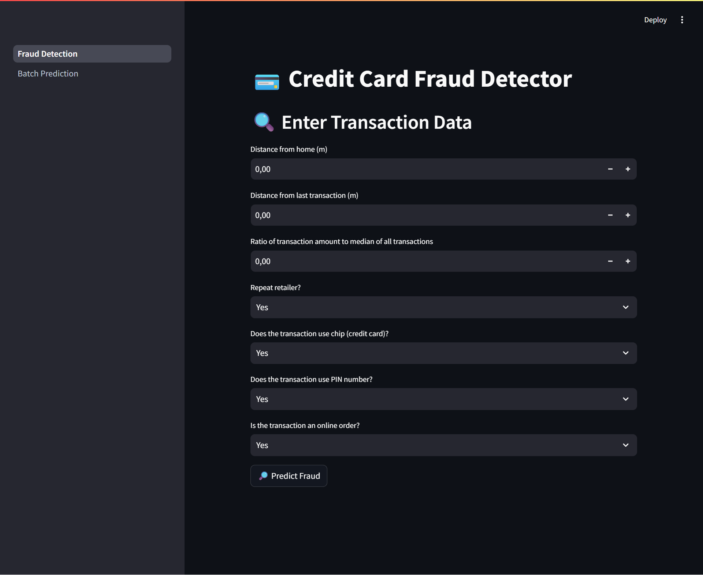
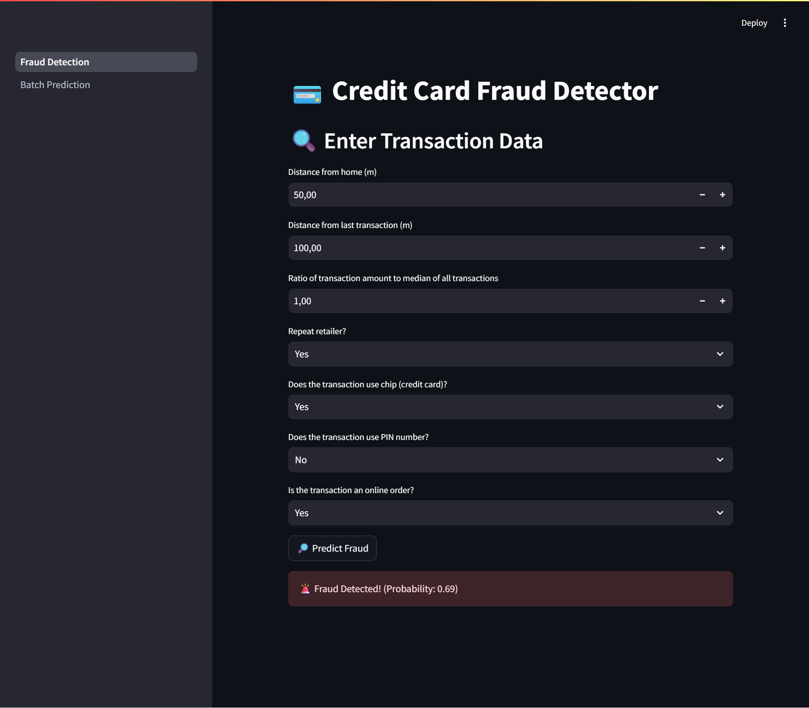
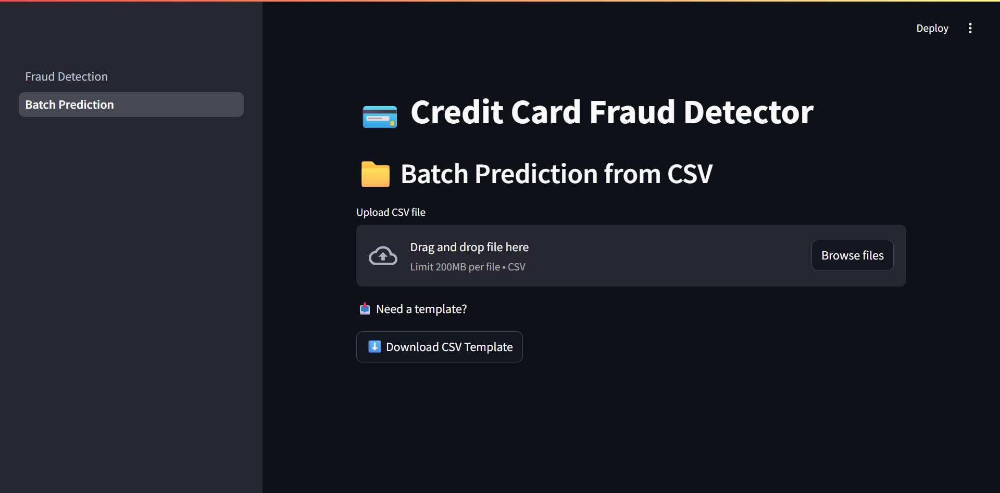
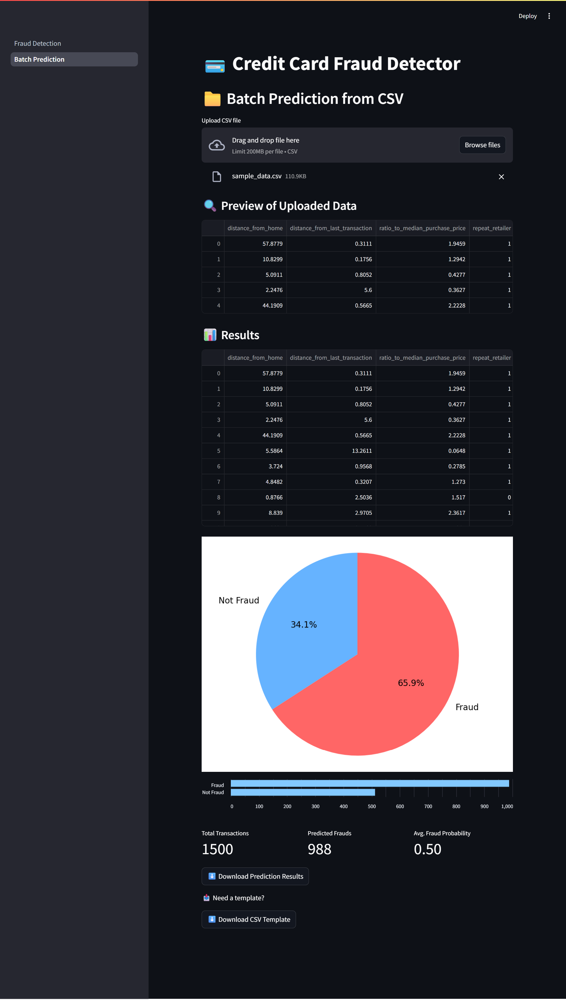

# 💳 Credit Card Fraud Detection App

A complete machine learning project to detect fraudulent credit card transactions using various classification models. This project includes:

- 🧪 Jupyter Notebook for model experimentation and evaluation
- 🌐 A Streamlit web app for realtime and batch fraud prediction

---

## 🧠 Models Compared

We experimented with the following models:

| Model                     | Performance Summary                                                                      |
| ------------------------- | ---------------------------------------------------------------------------------------- |
| **Random Forest**         | ✅ Best performing model across all metrics (accuracy, precision, recall, F1 score)      |
| Decision Tree             |                                                                                          |
| Logistic Regression       |                                                                                          |
| K-Nearest Neighbors (KNN) | ❌ Performed the worst initially. Slight improvement with SMOTE, but still underwhelming |

> 📌 Final model used in the app: **Random Forest**

---

## 📊 Dataset

- Source: [Kaggle - Credit Card Fraud Detection](https://www.kaggle.com/datasets/dhanushnarayananr/credit-card-fraud)
- The dataset consists of 2 classes:
  - `0` → Not Fraud
  - `1` → Fraud
- Features:
  - distance_from_home: The distance from home to the transaction location.
  - distance_from_last_transaction: The distance from the last transaction location.
  - ratio_to_median_purchase_price: The ratio of the transaction amount to the median purchase price.
  - repeat_retailer: Whether the transaction was made at the same retailer.
  - used_chip: Whether the transaction was made using a chip (credit card).
  - used_pin_number: Whether the transaction was made using a PIN.
  - online_order: Whether the transaction was an online order.

---

## 🌐 App Features

- 🔍 **Realtime Prediction**: Input transaction values manually and check for fraud
- 📂 **Batch Prediction**: Upload CSV file with multiple transactions
- 📊 **Visualizations**: Display fraud distribution and model evaluation
- 🧠 **Pretrained Model**: Uses saved `.pkl` model (Random Forest)

## 📷 Screenshots

   

   

## 📦 Requirements

- Python 3.8+
- Streamlit
- scikit-learn
- pandas
- numpy
- imbalanced-learn
- seaborn / matplotlib
- joblib
